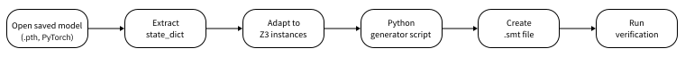
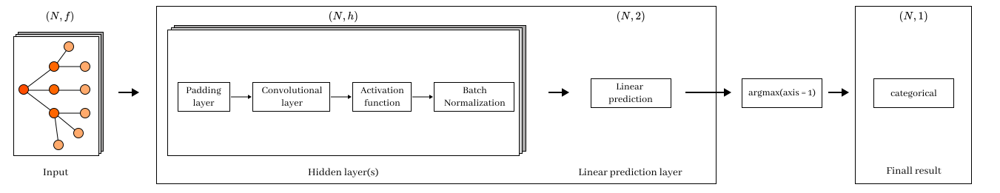
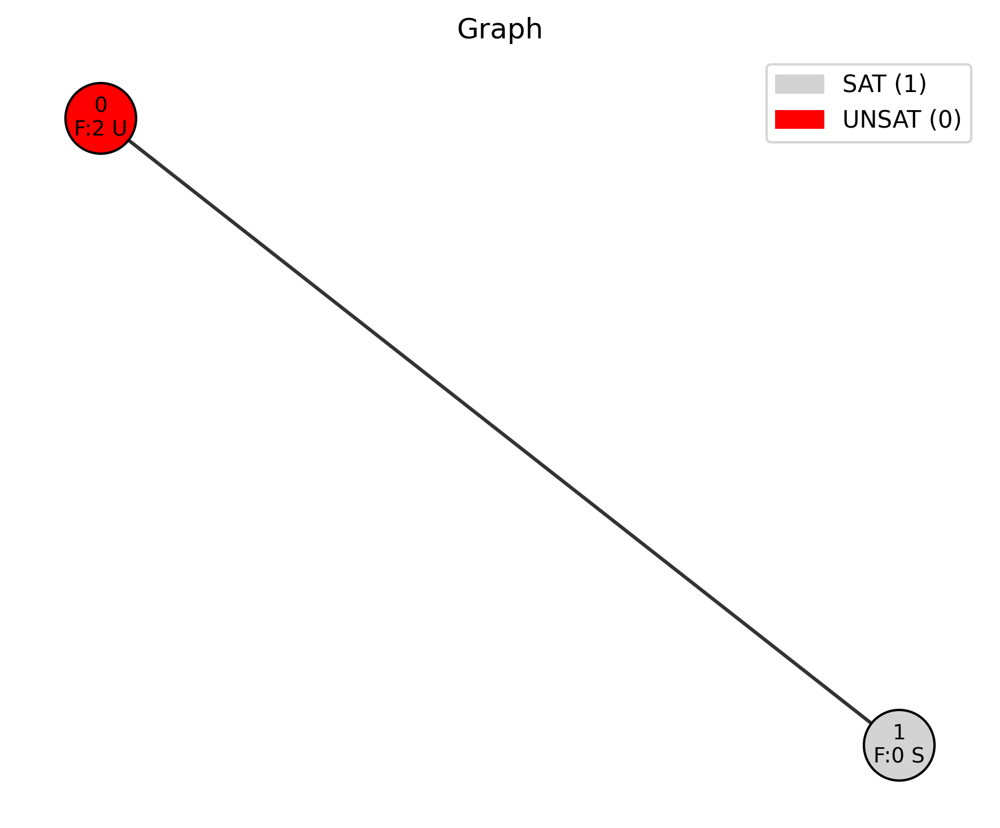

# Idea
Readme file with the detailed explanation about the files that were used in the Flow of the verification tool __before__ applying the Z3 tool. 

<a name="z3flow"></a>


"Figure 1. Z3 Flow. From Pythom to SMT"

According to the flow, firstly, we need to extract from the `.pth` file the state_dict of the model with the activation function. 

Firstly, we need to understand with which architecture we need to deal with. For this case, we present the [Figure 2](#full_model).

<a name="full_model"></a>

"Figure 2. Model to SMT."

Secondly, to make the flow smooth and under control we decided to do an example (hardcoded) to have a controll and understanding of the entire processes.

For this step we created the file `demonstration.py`.

After the simple case, we extrapolate our exale to the general muiltilayered case.

# Demonstration
The `demonstration.py` demonstrates how to extract the model parameters for the Z3 verification flow.

In this example, we use the Z3 flow illustrated in [Figure 1](#z3flow).

The script provides a step-by-step description of:
- which components of the model must be extracted, and
- how they are passed into the SMT encoding.

For this demonstration, we use a synthetic graph generated programmatically and labeled via the following expression: 
'A node is SAT if it has 1–2 neighbors with a specific property (green)' 
The color 'green' is encoded as feature index 2.

The visual representation of the graph is shown in [Figure 3](#test_graph).

<a name="test_graph"></a>

"Figure 3. Simple Graph for the analysis."

On this visuall representation we define for each node: id, feature and status. Status will be SAT if the node satisfy the property, unsat otherwise. This labell is the target for the task **binary** classification.

- Number of nodes is two
- Number of edges is equal to the numebr of nodes
- Number of features is 3 
- Number of features per node is 1
- Hidden dimmension of the GNN is 3
- Activation funtion is ReLU

Architectural Choices
1. Local aggregation (neighborhood aggregation): sum
2. Global readout (graph-level aggregation): sum

## Model Loading and Inspection
In this section, we demonstrate how to apply the theoretical framework to a practical input.
This example is used to validate and control the correctness of the computations.

According to the flow:
### Step 1: Define the Model Path
Specify the path to the trained model.
### Step 2: Load the Model
```python 
state = torch.load(selected_model, map_location="cpu")
```

After loading, we inspect the structure of the returned object:

```python
type(state): <class 'dict'>
num keys: 2
keys: ['state_dict', 'activation']
```

The loaded object is a dictionary containing:
- state_dict – stores the learned parameters of the model (weights and biases of each layer)
- activation – specifies the activation function used in the model

The state_dict is the key component for verification, as it contains all numerical parameters required to reconstruct the forward pass in the SMT formulation.
[Link on documentation](https://docs.pytorch.org/tutorials/beginner/saving_loading_models.html)

### Step 3:  Define the graph. 
To define the input graph, we specify the Feature Matrix (`x`) and Adjacency Matrix (`adj_matrix`). These matrices represent the node features and the graph structure, respectively.

> [!NOTE]
> For the numberical calculation we need to be sure that all our calculations are in the FLOAT32. To accive this with the NuPy arrrays we need to add the type `dtype=np.float32`, because by default it is `float64`. [Link on documentation](https://docs.pytorch.org/tutorials/beginner/saving_loading_models.html)

### Step 4: Local Aggregation
The local aggregation captures information from neighboring nodes.

A common approach in GNNs is to use the adjacency matrix to aggregate neighbor features. This is done via matrix multiplication between the adjacency matrix and the feature matrix:`agg_local=np.dot(adj_matrix, x)`
This operation produces a new matrix where:
- each row corresponds to a node
- each row contains the sum of feature vectors of its neighboring nodes

>[!Note]
> This is the right approach if your local aggregation function is sum. 

### Step 5: Global Readout (Global Aggregation)

The global aggregation combines information from all nodes in the graph into a single representation.

We need to sum the features of all the nodes in the graph, so we can use a matrix of ones to achieve this. 

`agg_global = np.sum(x, axis=0)`

> [!Important]
> Here we have a Tensor with the output dimension of the initial matrix x. These tensor will be applied to each column of the weighted matrix of the global Readout.

>[!Note]
> This is the right approach if your global aggregation function is sum. 

### Step 6: Extract the learned weighted matrices `V,A,R`. 
In this step, we extract the learned weight matrices and their corresponding bias vectors from the model.
Each transformation in the ACR-GNN is implemented using `nn.Linear`, which consists of:
- a weight matrix
 - a bias vector

In the `nn.Linear` module the default value of the bias is `True`. [Link on documentation](https://docs.pytorch.org/docs/stable/generated/torch.nn.Linear.html). 

Each of the matrix has own bias vector, which os not a vector, but the `nn.Tensor`. [Link on documentation](https://docs.pytorch.org/docs/stable/generated/torch.Tensor.numpy.html) 

`state['state_dict']['convs.0.V.linear.weight'].numpy(force=True).T`

> [!NOTE]
> V,A ,R should be transposed to be used in the SMT encoding, as they are stored in the format (output_dim, input_dim) in PyTorch, but we need them in the format (input_dim, output_dim) for the SMT encoding. 
[Link on documentation](https://docs.pytorch.org/docs/stable/generated/torch.Tensor.numpy.html)
>
> The template for the extraction of weighted matrix:
> `state['state_dict']['convs.{layer}.{weighted_matrix}.linear.weight'].numpy(force=True).T`
>
>The template for the extraction of bias vector wich correspond to the weighted matrix:
> `state['state_dict']['convs.{layer}.{weighted_matrix}.linear.bias'].numpy(force=True)`
>
> For example:
>
> `V = state['state_dict']['convs.0.V.linear.weight'].numpy(force=True).T, shape: (3, 3), dtype: float32`
>
> `b_V = state['state_dict']['convs.0.V.linear.bias'].numpy(force=True), shape: (3,), dtype: float32`

> [!Important]
> In the theoretical formulation of ACR-GNN, the combination is defined as: `xC+yA+zR+b`.
>
> In the architecture of the ACR-GNN the combination was defined as following `self.V(h)+self.A(aggr)+self.R(readout)`.
>
> In the practical implementation these descriptions are presented as following `(np.dot(x, V)+b_V)+(np.dot(agg_local, A)+b_A)+(np.dot(agg_global, R)+b_R)`. 
>
> This explicit formulation is used in the Z3 verification flow, where:
> - all matrix multiplications are represented as linear combinations. 
> - bias terms are added explicitly. 
> - each component (`V, A, R`) is handled separately.
>
>This makes the model fully compatible with SMT-based reasoning.

### Step 7: Activation Functions
The model employs piecewise linear activation functions, which preserve compatibility with symbolic reasoning and formal analysis. Supported activations include ReLU, ReLU6, truncated ReLU (trReLU), and LeakyReLU.
> [!Important]
> These activations are particularly suitable in verification settings because they can be represented as piecewise linear constraints, which makes them more amenable to symbolic reasoning than smooth non-linear functions such as sigmoid or tanh.

### Step 8: Applying the Batch Normalization. 
During the training phase, Batch Normalization learns and stores the parameters required for inference.
Therefore, for verification, we need to extract these parameters from the `state_dict`.
The required parameters are:

- gamma (learned scale) -- `bn_state[f"{prefix}.weight"]`
- beta (learned shift) -- `bn_state[f"{prefix}.bias"]`
- mu (EMA mean) -- `bn_state[f"{prefix}.running_mean"]`
- var (EMA variance) $\sigma^2$ -- `bn_state[f"{prefix}.running_var"]`

> [!Note]
> In this architecture, Batch Normalization is applied after the activation function.
> Its role is to stabilize the learned representation, keep it well-scaled, and make it suitable for the following layers.
>
> Although the original Batch Normalization paper introduces BN as a normalization layer within the training pipeline, the implementation used here applies it after the activation function.
> [Ioffe, S., & Szegedy, C. (2015)](https://arxiv.org/abs/1502.03167)

Originally, Batch Normalization is defined as:

$$
BN(p_i)
= \frac{\gamma (p_i - \mu_i)}{\sqrt{\sigma_i^2 + \varepsilon}}
+ \beta_i ,
$$

where $\gamma, \beta, \mu_i, \sigma_i^2 \in \mathbb{R}$ are the learned parameters.
However, SMT solvers such as ESBMC do not directly support non-linear arithmetic involving square roots. Therefore, we algebraically rewrite into an affine form. 

Expanding, we obtain:

$$
\begin{aligned}
BN(p_i)
&= \frac{\gamma}{\sqrt{\sigma_i^2 + \varepsilon}} p_i
- \frac{\gamma}{\sqrt{\sigma_i^2 + \varepsilon}} \mu_i
+ \beta_i 
&= a_i p_i + c_i ,
\end{aligned}
$$

where the coefficients are defined as

$$
a_i := \frac{\gamma}{\sqrt{\sigma_i^2 + \varepsilon}},
\qquad
c_i := \beta_i - a_i \mu_i .
$$

This reformulation eliminates the square root operator from the symbolic expression, as $a_i$ and $c_i$ are precomputed constants.
So for the verification we are using the $a_i$ and $c_i$ which are the two vectors with the dimension 
$\mathbb{R}^{1 \times h}$. Data for the calculation were taken from the state dictionary of the model.

The substitution by the affine form ensures that the resulting verification conditions remain within linear arithmetic, which is directly supported by SMT solvers.

In the code we calculete the $a_i$ and $c_i$ with the function `apply_bn_inference` and pass after as varibles `bn_a` and `bn_c`.

> [!Note]
> The transformation removes the square root from the symbolic expression.
> The coefficients $a_i$ and $c_i$ are precomputed constants.
> This makes Batch Normalization compatible with linear arithmetic reasoning in SMT solvers.
 

## Step 9: Linear Prediction and Final Classification

The learned embedding is converted into the model's output through a final linear transformation.

In theory, this corresponds to the classification function. In practice, it is implemented as the `linear_prediction` layer in the model's `state_dict`.

This layer maps the learned node representations to the output space: $R^(h x h) -> R^(h x 2)$
where the output dimension 2 corresponds to the binary classification task considered in the reference work [Barceló et al., ICLR 2020](https://openreview.net/forum?id=r1lZ7AEKvB&noteId=r1lZ7AEKvB&ref=https://githubhelp.com). 

The output of the linear_prediction layer consists of logits.
To obtain the final classification, an argmax operation is applied: `predicted_class = argmax(output, dim=1)`.

This selects, for each node, the class with the highest score.

Output after applying the Linear Prediction: $z = (z_0, z_1)$

Then:
```
if z[0] >= z[1]
    Class 0 is predicted
else:
    Class 1 is predicted
```

# `preparation.py`
Goal for the file is to prepare the input data [Figure 2](#full_model) to pass to the Z3 Flow [Figure 1](#z3flow).

Key aspects:
 1. Path to the model
 2. Extract the matrices for the Convolutional Layer
 3. Expract parameters of the Batch Normalization and make calculations to obtain  prepare them to the Z3 Flow.
 4. Extract matrices for the Linear Predicton Layer.